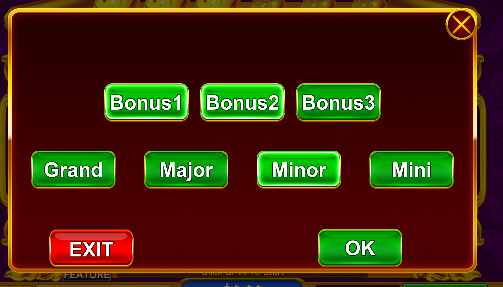

# RGS

```js
{
  "BonusCheat": {
    "BonusType": 3,
    "JackpotType": 4
  }
}
```

```csharp
[Flags]
    public enum BonusType
    {
        None = 0,
        Bonus1 = 1,
        Bonus2 = 1 << 1,
        Bonus3 = 1 << 2,
    }

    [Flags]
    public enum JackpotType
    {
        None = 0,
        Grand = 1,
        Major = 1 << 1,
        Minor = 1 << 2,
        Mini = 1 << 3
    }

 public enum CoinType
    {
        None = -1, //无
        Normal = 0, //普通数值金币
        Collection = 1, //收集金币
        Multi = 2, //乘数金币
        Extra = 3
    }

```

```php
        "symbols" => [
            "WILD",
            "PIC_1",
            "PIC_2",
            "PIC_3",
            "PIC_4",
            "PIC_5",
            "A",
            "K",
            "Q",
            "J",
            "T",
            "N",
            "SCATTER",
            "COIN"
        ],
```

```java

```