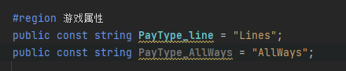
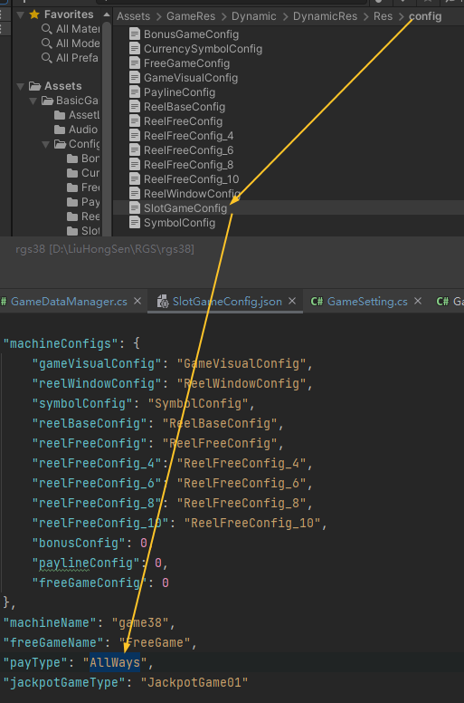
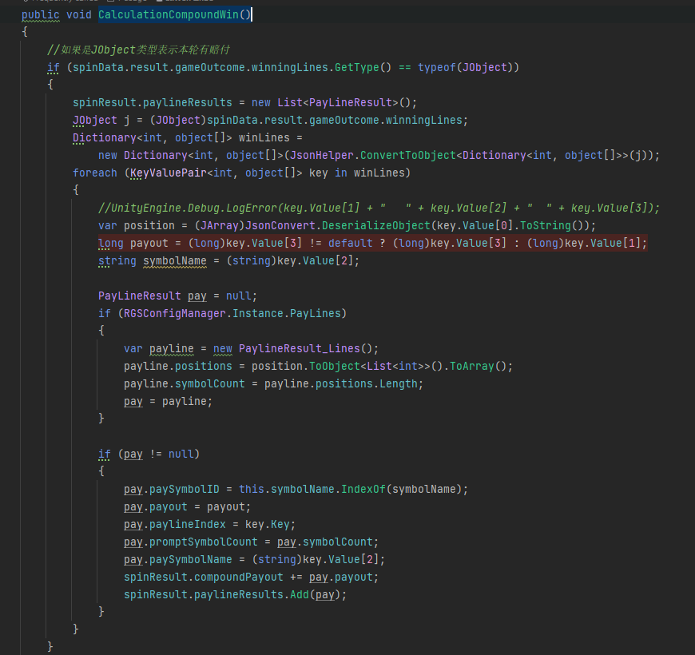
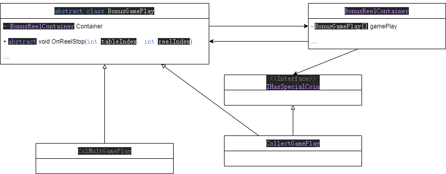

# RGS架构记录
- [RGS架构记录](#rgs架构记录)
  - [Spin](#spin)
    - [ButtonViewUIManager](#buttonviewuimanager)
    - [BasicSpinManager](#basicspinmanager)
    - [BasicGameStateManager](#basicgamestatemanager)
  - [自定义reel样式](#自定义reel样式)
  - [修改赔付](#修改赔付)
  - [Bonus Game](#bonus-game)
    - [配置](#配置)
    - [结构](#结构)
      - [GamePlay](#gameplay)

由于初次接触此框架加上项目时间原因不能能写出一份详尽的结构合理的框架文档，所以此文档仅能成为一份阅读笔记。或许能有点作用。


## Spin
### ButtonViewUIManager
Spin是从`ButtonViewUIManager`发出，不同游戏的SpinButton不同。
点击时会触发`OnTouchSpin()`,通过`GlobalEventRegistry`发出`GameSetting.TouchSpin`信号。
```java
GlobalEventRegistry.Invoke(GameSetting.TouchSpin, null, EventArgs.Empty);
```
而目前接受信号的两个类为此类自己
```java
  GlobalEventRegistry.Register(GameSetting.TouchSpin, Spin);
```
和`BasicSpinManager`:
```java
GlobalEventRegistry.Register(GameSetting.TouchSpin, TouchSpinHandler);
```

此类自己所调用的`Spin()`回调函数将会改变游戏状态真正使画面上的滚轮开始旋转，而`BasicSpinManager`将会发送请求到服务端获取此次Spin的结果数据。

在此类自己的`Spin()`中
```java
  BasicRGSGameManager.Instance.gameStateManager.SlotGameState = EnumCollection.SlotGameState.Spining;
```
为`SlotGameState`赋值将会在底层触发
```java
 GlobalEventRegistry.Invoke(GameSetting.GameStateChange, null, stateEventArgs);
 gameStateDic[_slotGameState]?.Invoke();
```
这可能将会是未来切换游戏状态所必须做的事情。
接下来就是`BasicGameStateManager`及其派生类`GameStateManager`处理Spin时间使其旋转。  

--- 

### BasicSpinManager
`BasicSpinManager`与其子类`SpinManager`将是未来构件代码的一个较为核心的**单例类**。
此类中在`GameSetting.TouchSpin`按虚函数的调用顺序大致为
`TouchSpinHandler()`->`SendSpin()`->`CheckSpinParam(spinType, sendParam)`->`NetWorkManager.Instance.SendPlay()`->`OnSpin()`async     
因为`NetWorkManager.Instance.SendPlay()`为向后端发送数据所以`OnSpin()`为异步（可能会被同步）回调。当`OnSpin()`被调用时会带回参数`PlayResult`类，在派生类中会反序列化此类数据并依据结果初始化`BasicSpinResult`及其派生类。
下述语句可能与本轮的结果有关。
```java 
 BasicGameViewManager.Instance.reelManager.SetResultData(spinResult.reelStopIndex);
```

当结果数据被设置完成后，会发出`GameSetting.SpinComplete`信号。此时已拥有本轮Spin的结果数据。
```java
 GlobalEventRegistry.Invoke(GameSetting.SpinComplete, null, new SpinCompleteGameDataEventArgs(specialGameData, normalGameData, jackpotData));
```
--- 

### BasicGameStateManager
此类将会因为游戏状态被更改从而触发`GameSetting.GameStateChange`事件后更改游戏状态触发自身对应的函数然后调用`BasicReelManager`->`BasicReel`旋转每一单独列。


## 自定义reel样式
Reel样式根据Json文件自动生成：
`Assets/GameRes/Game39/DynamicRes/Res/config/ReelWindowConfig.json` 
滚轮位置等信息的键为`reelLayouts`,而其值为下述对象所组成的array，对应每个滚轮的位置信息和可视Symbol数量等。
```js
{
    "index": 0,
    "symbolHeight": 2.34,
    "symbolWidth": 2.34,
    "visibleSymbol": 3,
    "position": {
        "x": -4.88,
        "y": 2.34
    },
    "scale": {
        "x": 1,
        "y": 1
    }
},
```

## 修改赔付
在`GameSetting`类中发现两个字符串常量：   
       
所以通过代码猜测可能在如下Json文件中修改属性为对应的字符串：      
        
但是修改之后会有报错，推测问题可能出在`SpinManager`->`CalculationCompoundWin()`函数，此处并没有对Always的处理或许服务器根本没有给我提供对应的数据，有点盲人摸象(还是需要后端)：     
    


## Bonus Game
Bonus因为以往的代码缺失，所以此处为我自己的实现，所以部分与原先架构不同。       
### 配置   
``` js
{
  "TriggerCoinCount": 6,    //暂时无用
  "InitBonusCount": 3,    //暂时无用
  "ColumnsCount": 5,      //列数
  "RowsCount": 3,       //行数
  "BaseRollStopCount": 15, //第一行第一列一次旋转的Symbol数
  "RollStopAdded": 1,   //其后每列旋转数递增
  "Spacing": {
    "x": 0.1,   //每个滚轮间的间隙
    "y": 0
  },
  "ReelPos": [ //一整张Table的位置，是个数组是为了游戏会有多个Table（但是游戏并没有依据这个配置生成对应数量的Table）
    {
      "x": 0, 
      "y":0
    },
    {
      "x": 0,
      "y": 10
    }
  ],
  "BonusReelSize": {  //一个滚轮的大小，通常对应一个滚轮背景的大小
    "x": 262,
    "y": 262
  }
}
```

### 结构
与该框架其他地方结构相同的是同样具有`BonusGameManager`和`BonusGameLogic`类用于对Bonus视图进行初始化和判断是否进入该游戏状态。        
在`BonusGameManager`中`EnterBonusGame()`函数内需判断是否进入了Bonus，如进入需调用`BonusGameLogic`的`EnterBonus()`以开始Bonus游戏。      
```java
//在进入游戏时此处需要判断本轮Bonus需要用到一个或是俩个滚轮之后作为参数传递给Game Logic
     BonusReelContainer[] containerInThisRound = new[] { _reelContainers[0] }; 
      GameLogic.EnterBonus(containerInThisRound, bonusGameData); 
```
在`BonusGameLogic`中需判断游戏玩法构建`BonusGamePlay`数组以作为**游戏策略（策略模式）**，同时设置对应Table的最大剩余此时。      
``` java
        BonusGamePlay multipleGamePlay = new MultipleGamePlay();
        BonusGamePlay collectionGamePlay = new CollectGamePlay();
        var gamePlays = new[] { multipleGamePlay, collectionGamePlay };
        GetSpecialCoinName(gamePlays);
        container.gameObject.SetActive(true);
        container.EnterGame(gamePlays, 3, bonusGameData); //TODO 修改MaxRemaining
```

#### GamePlay
游戏玩法部分，因单个游戏具有多个Bonus玩法所以采用暂时较为粗糙的策略模式将每种玩法与具体的滚轮之类的实体解耦。     
       
抽象类`BonusGamePlay`中定义了对使用它的`BonusReelContainer`的引用，用于在游戏过程中取得游戏数据。该引用会在`EnterBonus()`函数调用之前被赋值。同时该类声明了BonusGame的生命周期回调，继承该类的具体实现会在函数名对应时机接收到回调。      
```java
  protected abstract void EnterBonus();
  public abstract void OnSpin(); //点击时回调
  public abstract void OnReelStop(int tableIndex, int reelIndex); //当一个滚轮停止时回调
  public abstract void OnTableStop();  //当所在Table所有滚轮停止时回调
  public abstract void OnAllTableStop();  //当场上的所有Table停止时回调（因为有可能有的游戏玩法有多个Table）
```
这样的设计保证了`BonusReelContainer`类无需知道当前的游戏是什么玩法，在未来修改游戏玩法时中除非需要提供更多必要数据无需修改`BonusReelContainer`类。同时因为是数组所以组合类玩法也更容易实现（当然在传入游戏玩法类时需注意顺序，因为传入时的顺序会影响玩法触发时的顺序）

能够刷出特殊金币的游戏玩法需实现`IHasSpecialCoin`定义如下
```java
    interface IHasSpecialCoin
    {
        EnumCollection.CoinType Type { get; }
        string SpecialCoinName { get; }
    }
```
具体实现需要告知特殊Symbol预制体的需要传给SpawItem的名称和未来需要用以判断的`EnumCollection.CoinType`      
```java
        public EnumCollection.CoinType Type => EnumCollection.CoinType.Collection;
        public string SpecialCoinName => "SymbolCoin_R";
```