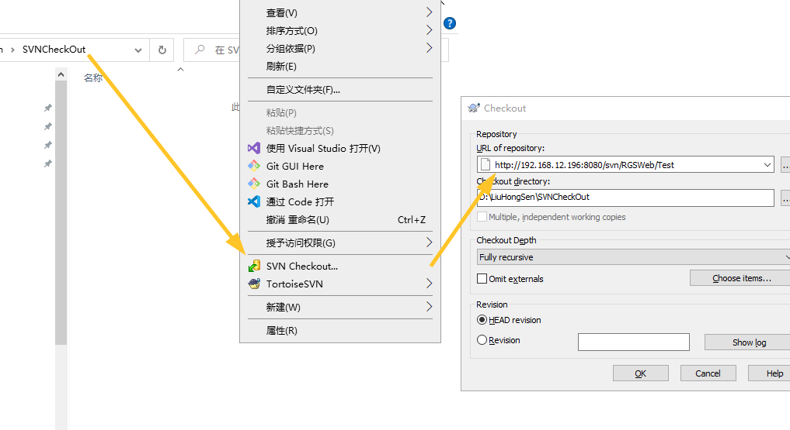
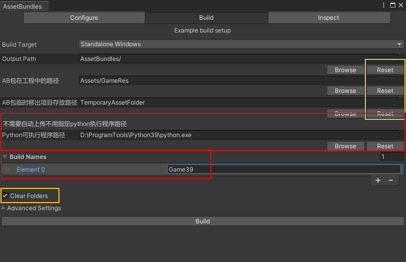

# RGS项目初始设置
- [RGS项目初始设置](#rgs项目初始设置)
  - [**`※文档中的图片资源多半已过时，尽量以文字为准。`**](#文档中的图片资源多半已过时尽量以文字为准)
  - [基本设置](#基本设置)
  - [**`如需按此篇后续内容修改请询问是否有对应的后端`**](#如需按此篇后续内容修改请询问是否有对应的后端)
  - [上传测试](#上传测试)
    - [准备AB包资源](#准备ab包资源)
  - [**`※此条目内容已过期，不过可以为其他未预料状况提供参考。`**](#此条目内容已过期不过可以为其他未预料状况提供参考)
    - [SVN上传](#svn上传)
  - [**`※此条目内容已过期，不过可以为其他未预料状况提供参考，后续框架更新将会使用Python自动上传SVN。`**](#此条目内容已过期不过可以为其他未预料状况提供参考后续框架更新将会使用python自动上传svn)
    - [内部版本的Asset Bundles Browser](#内部版本的asset-bundles-browser)
      - [打包与上传](#打包与上传)
      - [😷已知问题](#已知问题)

**`※文档中的图片资源多半已过时，尽量以文字为准。`**   
---
## 基本设置

在Loading场景中，`Loading.cs`脚本会通过网络下载AB包至内存以启动游戏。
测试时应修改token为一个不与其他人冲突的小于2000的数字。

**`如需按此篇后续内容修改请询问是否有对应的后端`**  
---
对于新游戏应在上述文件夹内创建新的游戏场景并更改Loding脚本的GameName属性以通过网络加载正确的脚本。      
    
  Note：此属性相关代码有可能在脚本内被改动如下图，需随机应变。  
    

修改`Assets/GameRes/Dynamic/DynamicRes/Res/config/SlotGameConfig.json`将`"machineName"`后的**值**修改成当前游戏名，此处会影响后续[内部版本的Asset Bundles Browser](#内部版本的asset-bundles-browser)   
      
当加载完成即会进入对应场景。       

## 上传测试
由于在Editor中运行游戏依然需要通过网络获取AB包，所以需要通过[RGS SVN](http://192.168.12.196:8080/svn/RGSWeb/)或是其[子目录](http://192.168.12.196:8080/svn/RGSWeb/Test/UnityAssetBundle/)
将当前改动提交至服务器然后运行游戏来查看修改。

### 准备AB包资源
**`※此条目内容已过期，不过可以为其他未预料状况提供参考。`**   
---
框架中会使用**Asset Bundles Browser**工具的自定义版本（此时正在改动），下述链接为Unity提供的原始版本以作备用，此文档暂时以原始版本为基础：        
[Asset Bundles Browser (GitHub)](https://github.com/Unity-Technologies/AssetBundles-Browser)      
[Asset Bundles Browser (RD Cloud)](http://cloud.518play.com/index.php/s/GdAs7Twg7Wwz3dF)      

在Unity中点击`Windos`>>`Asset Bundles Browser`>>`Configure`,如下图中所示创建于当前游戏名称相符的AB包并将对应文件夹拖至面板中（此操作只需执行一次）。   
       
然后，在`Asset Bundles`面板上方点击`Build`选项，设置好`Output Path`后点击下方的`Build`按钮后等待资源打包（面板上的细节请自行百度）。    
   

### SVN上传  
**※需安装[SVN (RD Cloud)](http://cloud.518play.com/index.php/s/EniZPmtqLFa8Dx9)**     

SVN路径 `http://192.168.12.196:8080/svn/RGSWeb/`    
 在空白文件夹内点击右键后点击`SVN Checkout`，在弹窗中填写上述Url后点击OK,填写SVN账号后等待拉取完成。
     

**`※此条目内容已过期，不过可以为其他未预料状况提供参考，后续框架更新将会使用Python自动上传SVN。`**    
---    
将上一节中打包好的AB文件复制入SVN的`\UnityAssetBundle\Game39\V1_0\StandaloneWindows`文件夹并提交,等待提交完成后回到Unity运行，会发现改动生效。

### 内部版本的Asset Bundles Browser    
**※需安装 [Python39 (RD Cloud)](http://cloud.518play.com/index.php/s/Zr9wgXFWB4nPqaN)**   
内部版本对于上述流程的重复性使用Python脚本进行了自动化，内部版本包含在新版游戏的框架内。参考[准备AB包资源](#准备ab包资源)   
对于上述流程同样需要拉取SVN资源至本地。和在**Asset Bundles Browser**中传入对应资源。
资源位置相对有些改动，此时游戏框架至包含单个游戏而曾经的版本整个项目包含所有游戏。项目位置如下图。    

修改`Assets/StreamingAssets/Config/`文件夹中的`AssetConfig.json`和`LocalAssetConfig.json`文件中`"assets_version"`的**版本号**避免与其他人上传的资源冲突,记得以后修改回来。      

在使用前需修改项目**Assets文件夹**的上级目录中的`..\BatchTools\SingleCopyAssetBundle.py(相对于Assets文件夹)`内的绝对路径：     
  将`D:\ziliao\RGSNetWeb\Test`替换为上文中SVN Checkout的文件夹内的`Test`文件夹例如`D:\LiuHongSen\SVNCheckOut\Test`（因编写时间问题此图中的文件路径可能与前文中的不匹配请见谅）    
       

  修改好py后，回到unity，在Unity中点击`Windos`>>`Asset Bundles Browser`>>`Build`(进入build页面而不是点击下文中的那个Button)。    
  对于未设置的路径选项请点击`Reset`设置为默认值，然后设置`Python路径`至本机Python的安装位置（其实如果系统中有Python所在文件夹的环境变量，直接填入`python`即可），确认勾选了`Clear Floaders`,之后添加当前游戏的`Build Names`。     
  点击下方的`Build 按钮`等待控制台输出**Upload svn success**，此时资源包应该成功更新到服务器，运行游戏查看更新。一定要关注Unity控制台的输出，已知异常请参考后续章节。
    

#### 打包与上传
打包需要使用RGSBuildProfile，上传等操作需要使用BacthTools里的脚本

#### 😷已知问题
- 在安装Python和SVN之后或是遇到玄学问题请重启（重启万能，至少它能解决很多环境变量相关问题，不然就得花费巨长时间进行一个走近科学😂）
- 在点击`Build按钮`之后控制台输出如下图，请修改脚本以**触发Unity的脚本Reload**再重新点击`Build按钮`进行上传。   

- 初次创建项目打包会遇到如下问题，解决办法就是去目标位置创建一个文件夹     

- 如发现资源文件未拷贝到特定文件夹，请确认修改`Assets/GameRes/Dynamic/DynamicRes/Res/config/SlotGameConfig.json`将`"machineName"`后的**值**修改成当前游戏名。

