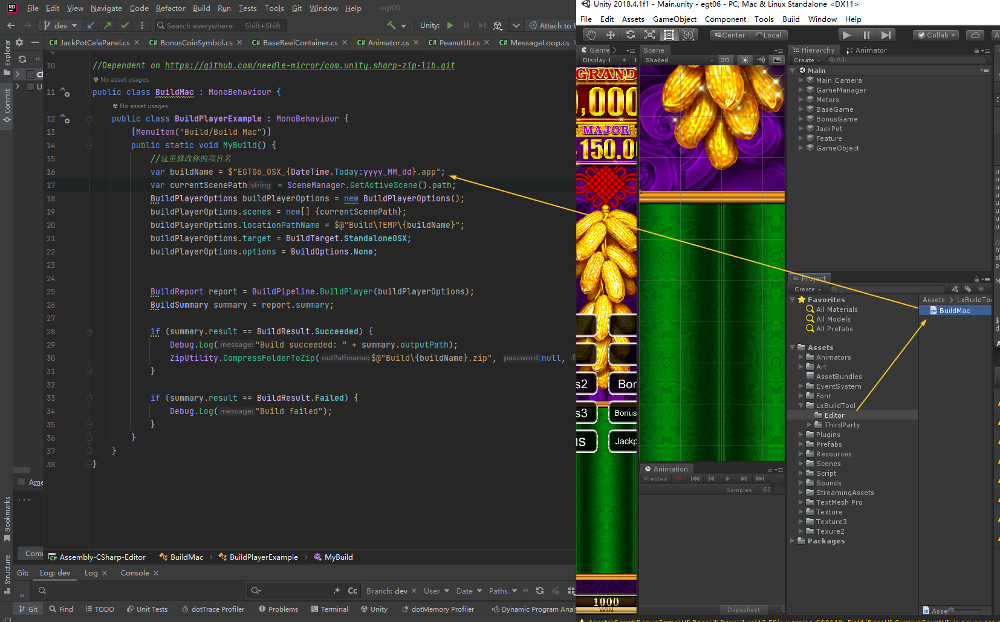
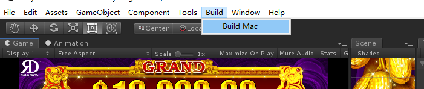
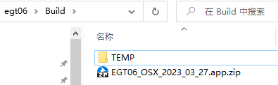

# Mac打包工具
[LxBuildTool](http://cloud.518play.com/index.php/s/dYQERaDzQBYsLWj)其实就是基本的Mac打包+zip压缩。   
ThirdPart内为Zip压缩功能依赖，如与其他包冲突可以删除。   

## 使用
- 先在如图所示文件夹打开该构件脚本修改项目名称。

- 然后在Unity内选项来选择Build Mac等待打包完成
  

- 最后在项目文件夹的`Build/`会出现打包完成的zip包   
