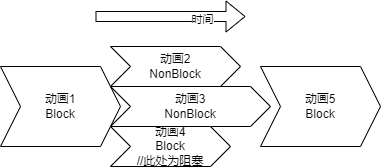
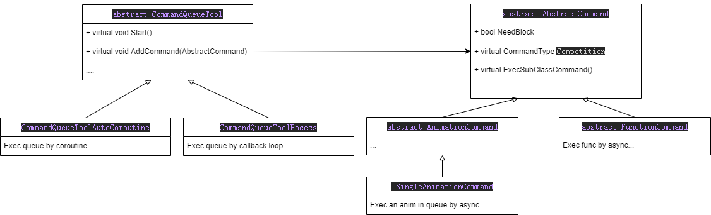
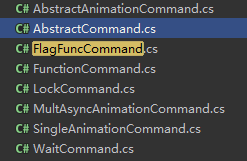

# 命令队列组件


## 引言
很显然在游戏前端的代码中播放的动画需要根据需求进行同步和异步播放，遂打算将动画放入队列以达到按需求进行同步异步。    
该工具参考现代图形学API **Vulkan**的设计模式，但是缺少了诸如**Command Buffer**和**Command Pool**之类的组件，不过基本功能已经可用于实践。

其实Unity自带的动画控制器完全可以胜任此类功能，在RGS项目中的`SkeletonAnimation`其实应该也带有类似的队列调度。此物件产生于想去造轮子并不断根据需求重构代码的私心。如果仔细查看代码会有一些奇怪的解决方案（比如有些命令实现了一个迭代器接口）。这就很有趣。       
**经过几次重构之后此工具能同步任何逻辑而并非只是动画，如果加了锁并且摆脱Unity的API之后其实也可以进行线程间通信(估计很低效吧)**      
此工具的设计中有不少缺憾待改进。

## 功能
可以通过此组件在某一帧构建出未来数帧中需要播放的动画及指定他们的顺序和阻塞状态，在调用`Start()`后开始同步或异步播放动画。      
假如在某一帧中顺序添加动画1-5，其中动画2、3为非阻塞动画，动画播放与时间顺序如图所示：     
    
非阻塞的动画会异步播放，而所有异步播放的动画会被添加到一个Fence中等待所有异步播放的动画都播放完成才会释放阻塞。    
//其实这个Fence集成在Runtime中是一个设计失误，应设置额外的组件去实现此类功能。


## 基本结构
本工具包含两部分，一部分是工具的主体，包含一个调用和管理命令的命令队列Runtime，和具体实现的Command，而只需要实现特定的接口就可以自定制Command的RT行为。
    

### Runtime

在具体实现中`CommandQueueToolAutoCoroutine`为通过Unity协程轮询实现的命令调度，而`CommandQueueToolPocess`为通过回调函数自我循环实现的命令调度，后者看上去很理想但是在播放动画衔接时会出现闪帧问题所以暂时放弃维护。    
在设计上，Runtime只需要知道命令**是否阻塞**、**何时释放**，而无需知道它管理的具体的命令类型，所以它保存的是`abstract AbstractCommand`的抽象类
如非必要无需具体了解Runtime时如何实现的。在使用中只需要了解一些基本接口即可。    
示例如下：
```java
    private CommandQueueTool _commandQueue;
    ...
    _commandQueue = new CommandQueueToolAutoCoroutine(gameObject); //此处使用具体实现初始化该类
    bonusExitFlagCommand = new FlagFuncCommand();
    _commandQueue.AddCommand(bonusExitFlagCommand); //添加命令
    _commandQueue.Start();//开始执行命令
    _commandQueue.OnAllCommandExecComplete += () =>
            {
               //当命令全部被执行完成并释放时的回调
            };
```

### Command
Command为命令中实现具体功能的，工具中提供几种常用的命令如下   
    
其中最常用的为`SingleAnimationCommand`,是调度动画播放的命令。    
值得一提的是，因为向队列中添加的命令只要是`AbstractCommand`的子类并在实现中说明一些必要属性比如是**否阻塞（`NeedBlock`属性）**和**何时释放(`InvalidAndReleaseBlock(this);`释放函数，非阻塞释放无效果)**，即可被调度，所以继承并实现它可自定义新的命令。`FunctionCommand`为最简单的命令实现，欲自定义命令可作为参考。

```java
  public class FunctionCommand : AbstractCommand
    {
        public override CommandType Competition { get; } = AbstractCommand.CommandType.NonCompetition;//这里需要标记命令的类型。因为同一个Object不能同时播放两个动画，这样会与前方命令冲突的的需要设置为Competition，而不会与其他命令冲突的直接设置为NonCompetition

        private Action _action;

        public FunctionCommand(Action action)//构造函数传入函数指针预定在**未来**某时间被执行
        {
            _action = action;
            NeedBlock = false;//**设置为非阻塞** 
        }

        protected override void ExecSubClassCommand()
        {
            _action.Invoke();//执行预定的函数
            InvalidAndReleaseBlock(this); //**释放阻塞 一定不要忘记释放**
        }

        public override IEnumerator<BaseCommandArgs> GetEnumerator()
        {
            return null; //它并没有子参数 所以return null即可
        }
    }
```

#### AnimationCommnad
动画队列是此物件的初衷，但是随着需求的改变一些最开始的设计失误开始浮出水面，一些不该被暴露的属性必须设置为**Public**很显然增加了误用风险，虽然尽可能通过一些技巧比如构造函数限制必要参数传入但是误用风险依然存在。如果有**friend**关键字能声明友元类会对此有很多改善，或是将一些类再分化成多个子类。

单个动画的动画命令构造函数如下：   
 ```java
 public SingleAnimationCommand(AnimationCommandArgs commandArgs)
 ```
***记得设置`NeedBlock`（默认为true）属性以指定该命令是否会阻塞后续命令，非阻塞则会和后续命令一起开始执行**     

动画调度队列的设计其实相对复杂一些，因为它需要接受一些自定义参数。 
```java
 public class AnimationCommandArgs : CompetitionCommandArgs
    {
        public static AnimationCommandArgs Build(GameObject obj, int animationHash)
        {
            return new AnimationCommandArgs
            {
                GameObject = obj,
                AnimationNameHash = animationHash
            };
        }

         
        //通过Animator.StringToHash()得到的Hash值，也就是此命令想要播放的动画的Hash
        public int AnimationNameHash { get; set; }
        
        //是否需要在播放前Rebind
        public bool RebindAnimation { get; set; } = false;

        //默认为null表示不循环播放动画，如播放的动画需设置此参需在Inspector设置动画属性为可循环
        public LoopArgs Loop;

        //在动画播放之前的回调，通常用于设置动画的Active
        public Action<AnimationCommandArgs> BeforeAnimationPlay { get; set; }

        //在动画开始播放时的回调，预留的
        public Action<AnimationCommandArgs> AnimationPlayCallback { get; set; }
    }

```
需要注意的是`LoopArgs Loop;`为`null`时就算在Inspacter中设置动画为Loop动画依然只会播放一次动画即释放阻塞。当然播放此动画的GameObject未播放其他动画那它就会继续播放这个Loop动画（不知道这里是否反直觉，我觉得还好）

```java
  public class LoopArgs
    {
        //动画持续时间 此参数和LoopCounter只需设置一个，会影响AnimationCommand的EndTime
        public readonly float During = 0;

        // 动画循环次数 ，此数值会根据动画持续时间通过计算获得并在动画播放过程中被减少至0，所以此参数和During只需设置一个
        public uint LoopCounter = 0;

        //当一次动画播放完毕，会回调此事件，Loop会进行循环次数的此回调
        public Action<uint> AfterLoopCounterChange;

        public LoopArgs(float during)
        {
            During = during;
        }

        public LoopArgs(uint loopCounter)
        {
            LoopCounter = loopCounter;
        }
    }


```
LoopArgs的设计或许是最大的设计失误，构造时应只通过构造函数构造避免错误设置，当然你可以设置上边的`AfterLoopCounterChange`属性以接受回调（但是基本没咋用过）。
重构的话或许应该把用到此类中两个属性的函数提到此类中以将`During`和`LoopCounter`变为`private`。