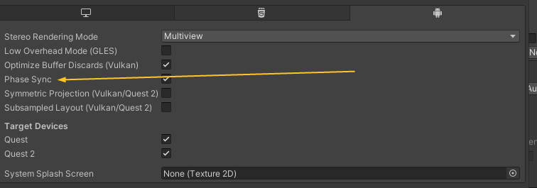
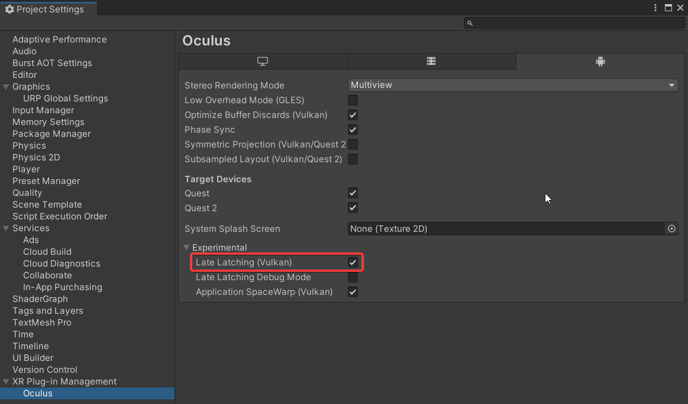

# Oculus文档记录
- [Oculus文档记录](#oculus文档记录)
  - [基本设置](#基本设置)
  - [Avatars](#avatars)
    - [Entity Features](#entity-features)
    - [优化提示](#优化提示)
  - [网络](#网络)
    - [网络模型](#网络模型)
    - [序列化](#序列化)
    - [Oculus SDK](#oculus-sdk)
  - [特性](#特性)
    - [Fixed Faveated Rendering](#fixed-faveated-rendering)
    - [Phase Sync](#phase-sync)
    - [Late Latching](#late-latching)
    - [VR Compositor Layers](#vr-compositor-layers)

## 基本设置
Oculus会自动设置MSAA但是貌似对URP管线支持不到位不能自动设置     
`Monoscopic`：启用时双眼使用同一张经过中心摄像机渲染的同一帧画面，不推荐使用    
`MinRenderScale`：最小自适应分辨率，这里要求文档中需要不低于85%，但是默认时70%   
`Profiler TCP Port`：TCP性能监视器端口，在Debug和dev build下被开启，Oculus》Tools》Oculus Profiler Panel下查看   


## Avatars

### Entity Features
Rendering_WorldSpaceTransforms 告诉native SDK去计算世界坐标变换，这些结果只会用在GPU蒙皮和一些关键的特殊骨骼节点上，如果关闭这个选项会节省CPU的消耗

AnalyticIK 暂不支持
ShowControllers 暂不支持
网络部分此处分类两类，一个本地一个remote，在游戏中对应其他玩家的Avatar应设置为Remote且不应设置其他的本地对于Avatar的输入。

### 优化提示
文档中的一些优化选项，基本都是一些简单设置一件解决，那代价是什么？

- 使用Oculus的蒙皮替代Unity默认的会节省GPU消耗
- 身体解算（Body Solver）可以挪到其他线程，我看代码有async之类的关键字估计是做这个的
- 意思有可能是使用嘴唇同步的时候在初始模式和增强模式之间来回切换以减少CPU消耗


## 网络
网络部分提供了Avatar动作序列化，但并未实现网络接口，我记得Native页面提供了P2P说明。官方的P2P功能**包括Voip**在**2023年3月被弃用**（现在是2023年3月16日），他们推荐第三方库例如Photon。很显然网络部分相较来说更加复杂，可以拿出当作单独的设计来写。     
也多亏VR内置的游戏使用内置Web引擎可以减少设计的复杂度，如果内置游戏随程序打包Unity的IL很容易被反编译（当然它是编译到APK是否真的这样存疑，说到这里可以考虑下代码混淆，但该看明白这东西的人还是能看明白）而且如果结算结果运行在本地内存易被修改（也就是外挂）。   
很显然网络部分包括**网络模型**、**序列化**。


### 网络模型

- `C/S`，网络带宽要求较小且稳定，网络压力集中在服务器为$O(n)$,可客户端间通信的延迟为2n。
- `P2P`，摆脱服务器的需求(并不能，至少不完全)，缺点是不稳定，P2P打洞严重依赖玩家的网络拓扑结构，不同NAT类型打洞成功率不一样，打洞之后能否稳定传输也无法掌握。如果P2P的话网络压力对于每个客户端为$O(n^2)$，但网络延迟只为对应链接间的延迟

### 序列化
      

去打听了一下其他程序的做法，鉴于有着这样需要更快速的编解码需求，可能Json并不是最合适的数据包载体。可能需要像protobuf和CBOR这样的的二进制协议，数据包更小且编解码速度更快。    
- protobuf使用者更多但编码后是纯二进制，当需要查看数据包内容时不太友好。  
- 而CBRO数据二进制而变量名是明文，很显然这样做数据包的体积会更大，编解码相对protobuf稍微逊色，但并不会像Json那样差出几个数量级。不过这种协议用户较少，是否有成熟的库支持或是文档支持还存疑。

  
可能网络部分的插件会自带序列化的功能，谁知道呢。

### Oculus SDK
这部分Oculus提供好友列表及邀请功能，没细读，但是估计挺麻烦的。


## 特性
### Fixed Faveated Rendering
FFR，降低屏幕周边次要区域的分辨率，可节省GPU消耗。   
须在脚本中开启
```c
// it's the maximum foveation level
OVRManager.fixedFoveatedRenderingLevel = FixedFoveatedRenderingLevel.High; 
OVRManager.useDynamicFixedFoveatedRendering = true;
```

### Phase Sync
减少延迟,与固定帧率渲染不同，在两帧之间渲染以避免过早渲染图形产生延迟，
- 没有额外性能开销，
- 如果应用程序的工作负载剧烈波动或频繁峰值，相位同步可能会导致比不启用时出现更多的过期帧。


### Late Latching 
应该是减少手柄输入的延迟，开启位置文档中有写但没找到，图形API应设置为Vulkan
   
   
### VR Compositor Layers
应该是优化文字显示效果，消除文字抖动的。