## 待办
dll的命名空间划分，   
framework的划分     
## 问题 
虽计划分了模块但是原本的框架依赖项复杂 应抽出接口将依赖整理为单向的依赖（暂时问题已经解决）   

考虑到资源复用，将游戏放在同一个项目打包方便，会是较好的解决方案，但是随着游戏数量的增加可复用资源的状况会更加复杂。   

是否，将分出的模块脱离Unity   

需要求后续命名空间的名字   

ab包打包的场景诸如layer和Tag 怎么一并打包       

## 待检测
很显然不同的命名空间的同名类的静态变量不在内存的同一位置，可以使用他们的静态变量为全局提供支持.   
续：再次很显然这样做会让VR端不能兼容多个相同的游戏   

意料之中的插件依赖的问题很难解决，或许每个游戏提供一个Audio的实现？         
游戏能跑起来但是插件对引擎的引用出了问题很奇怪。         


## 关于Vr的后处理
[Unity 单通道立体渲染](https://docs.unity3d.com/cn/current/Manual/SinglePassStereoRendering.html)  
Unity中关于VR的渲染模式有两种，单通道模式和多pass模式,设置位置如下图
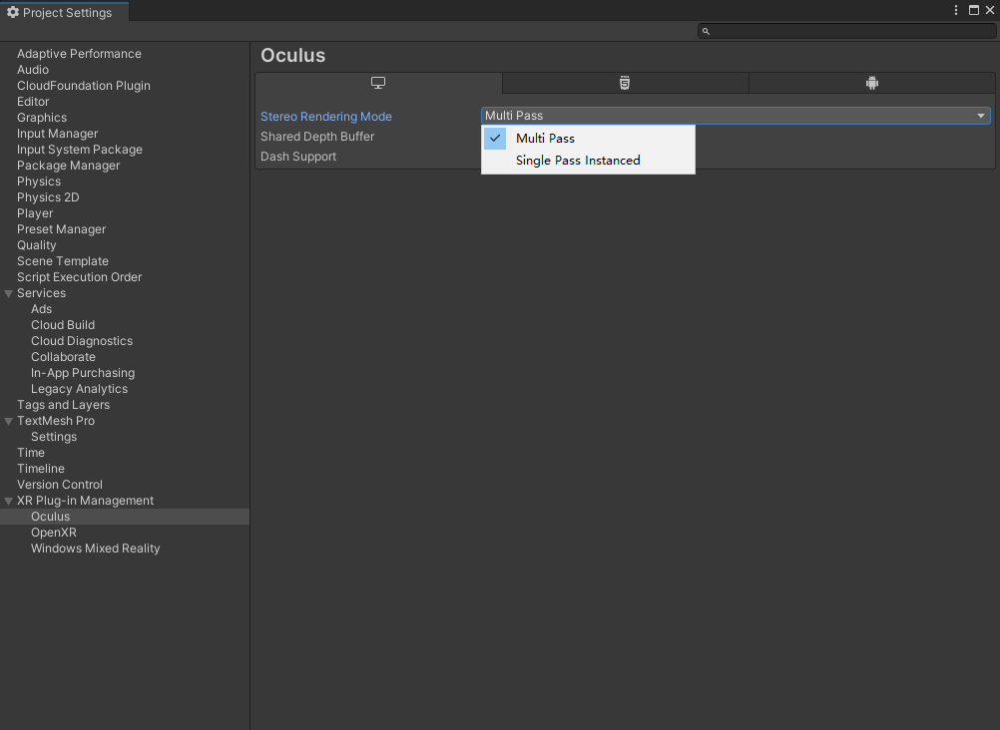    
在进行后处理之前，单通道模式双眼的渲染结果会被渲染进同一种Texture（双倍宽度）此时如果使用传统的后处理Shader有可能在shader内接受不到_MainTex。   
按理说应该是UV不正确导致被处理的图像被拉伸，可是通过Renderdoc debug发现,2023版本中_MainTex并未传给GPU或是没被GPU找到所以显示的是一张默认白色的纹理（顺带一提Unity的Fream Debug却告诉我纹理已经传了进去，CNM）,我想起来了，这里的纹理传进去的是个Array而传统的shader这里只有一张Tex。
那么解决问题的方法就变得可以简单也可以复杂。

-  把单通道修改为多通道
-  在shader中修改纹理映射   

很明显第一种方式最简单只是修改一个选项，但很显然这多半会增加DrawCall，两个相机自己玩自己的，甚至有可能让数据在显存和内存之间坐过山车。这是一个可以作为解决方案的方法但绝对不是一个方法。   
那第二种，估计就得细细地品上边的文档了，Unity提供了对uv进行正确映射的接口，但是这绝对是一个正经选择。
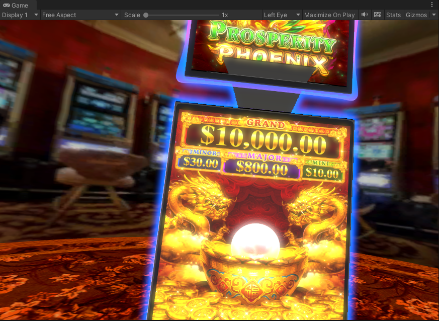

细品完上述文档后`经过一系列头铁之后发现MainTex缺失是Unity的Bug`,`Bolit()`函数就是不能将渲染结果帧传递给Shader的`_MainTex`属性，其实可以取巧去手动设置`_MainTex`属性。   


好吧并不是bug ，又逛了一圈GitHub发现把UV重映射放到vert里就好用了,TMD，那这是文档的问题？？？文档说放Frag里，CNM。
```cpp
      Pass
        {
            CGPROGRAM
                 #pragma enable_d3d11_debug_symbols
            #pragma vertex vert
            #pragma fragment frag
            //使用宏选择_Maintex是否是数组形式
            UNITY_DECLARE_SCREENSPACE_TEXTURE(_MainTex);
            half4 _MainTex_ST;
            float4 _LeftEyeColor;
            float4 _RightEyeColor;

            #include "UnityCG.cginc"

            struct appdata
            {
                float4 vertex : POSITION;
                half2 texcoord:TEXCOORD0;
                UNITY_VERTEX_INPUT_INSTANCE_ID
            };

            struct v2f
            {
                float4 vertex : SV_POSITION;
                half2 uv : TEXCOORD0;
                UNITY_VERTEX_INPUT_INSTANCE_ID

                //获取是那只眼镜的index
                UNITY_VERTEX_OUTPUT_STEREO
            };

            v2f vert(appdata v)
            {
                v2f o;

                UNITY_SETUP_INSTANCE_ID(v);

                 //获取是那只眼镜的index
                UNITY_INITIALIZE_OUTPUT(v2f, o);
                UNITY_INITIALIZE_VERTEX_OUTPUT_STEREO(o);

                o.vertex = UnityObjectToClipPos(v.vertex);
                //重新映射Texcoord 必须在vert里 手册里说放在frag里，TMD跟厄本那不好用
               o.uv = UnityStereoScreenSpaceUVAdjust(v.texcoord, _MainTex_ST);
                return o;
            }

            fixed4 frag(v2f i) : SV_Target
            {
                UNITY_SETUP_STEREO_EYE_INDEX_POST_VERTEX(i);

                //宏决定采样数组还是单个Tex
                fixed4 myTex = UNITY_SAMPLE_SCREENSPACE_TEXTURE(_MainTex, i.uv); //插入
                return lerp(_LeftEyeColor, _RightEyeColor, unity_StereoEyeIndex) * 0.3 + myTex * 0.7;
            }
            ENDCG
        }
```

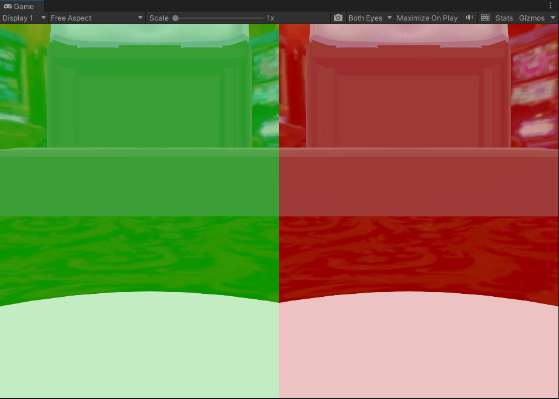


## DoTween插件问题
DoTween可通过提供的UI插件设置所启用的模块，在对其引用时应用UI创建Assembly然后再对应模块添加引用。这一块的依赖很奇怪。如图，很显然这是创建之后的状态。          
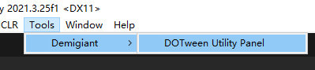            
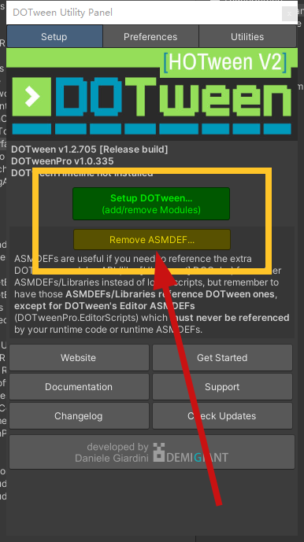       

TMP相关的依赖问题暂时还不知道咋解决。      

由此可以发现暂时的模块划分的颗粒度相对于较标准的插件过大了。     

## Processable
很想试试新的资源管理插件。但是暂时还是用现成的代码。     

## Asset Buldle
应该自定义Bundle Build流程生成所有的包名(雾件)      


## Dll向后兼容
将模块拆开后游戏将会持续迭代而如何保证在进行改变之后所依赖的dll向后兼容是个很大的问题，对于interface应当在定下原型出第一个游戏之后不再改变。对于整个DLL来说应保证增量更新而不是修改更新。        
**导入Dll的时候不要直接在编辑器开启的时候导入，会卡住不动**，不知道是不是只有我会遇到这种傻逼卡住不动的问题     

## 错误处理
由于VR端无法直接访问Slot端代码，应注意提供详细的错误处理     

## 待讨论
- [ ] 整个后端    
- [x] Scriptable项目和配置文件问题    

CNMLGB的Unity LoadScene竟然不反回Scene的句柄    


## 打包后StreamingAsset无法正常使用
Android的`StreamingAsset`路径格式相比在调试时更加严格
不要打多余的`/`


## 纹理压缩
查了一下发现安卓ASTC格式6*6，然后maxsize调整为2048 暂时

## 待验证

- Strip Engine Code     
VR实机报错取消这个选项 但是可能时因为裁剪问题所以无法加载一些组件，所以应该在在之后将此选项修改回去后尝试其他解决方案。      
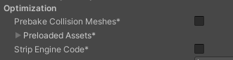
此问题已解决：[could not produce class with id ](#could-not-produce-class-with-id)


- 非热更新Dll版本变化的兼容性测试 

## `[Serilizable]`对象在跨工程热更新时无法被正确反序列化
之后不再会用此特性描述的类而是将属性直接挂载在Component上
两个工程使用**odin**插件使用`SerializedScriptableObject`序列化配置文件 ,因其内部有一个存储数据的`SerializationData`结构使用`[Serializable]`这相当于将一个通用的`[Serializable]`类型放置于AOT所以热更新后虽然不会显示在Inspector面板，但是数据没丢。
双端使用odin插件可以解决一部分问题

## 创建新Object的时候会忘记添加layer

## 后端
后端如何判断哪个Player是空闲的？
如果需要画面同步，可以创建一个后端接收的队列
后端的数据和现在的框架的一个转换


## 反思
还是在项目里留下了在做某事前后**必须**去做另外一件事的逻辑，应该尽量避免的。    

能想到的所有的解决方案都需要大量时间重构代码，也无法保证花费时间后的结果，要不要重构

应该更仔细得读文档能省下不少时间

设计倒是是否过于死板

考虑解决方案犹豫不决   
 

## could not produce class with id 
这是上文[待验证](#待验证)中的问题的解决方案，经后续验证不需要取消勾选`Strip Engine Code`选项。   
#### 问题描述
热更新场景未被正确加载，编译到VR后运行查看Log会出现下图错误。 
 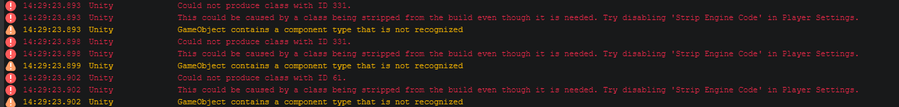

 #### 解决方案    
 StackOverFlow上的答案
 [What does "Could not produce class with id" mean in Unity?](https://stackoverflow.com/questions/52880492/what-does-could-not-produce-class-with-id-mean-in-unity)    
这个是IL2CPP编译时对代码裁剪优化时产生的，虽然热更新插件会自动生成`link.xml`和补充AOT，但是依然无法补充完全。所以需要手动添加。

在此链接内：[YAML Class ID Reference](https://docs.unity3d.com/Manual/ClassIDReference.html)查找报错id对应的类,此处id为**331**和**61**，查找结果是`BoxCollider2D`和`SpriteMask`,在Unity代码中查看相关类的定义：     
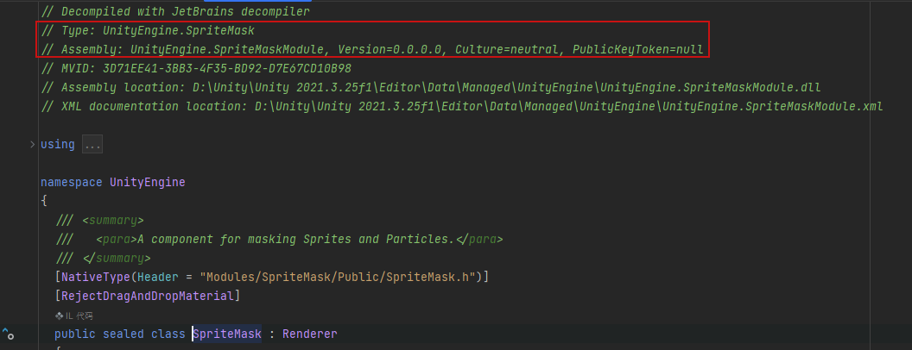     
记录上述红框内的内容然后在VR端**Assets**目录的link.xml内添加引用。
``` XML
<assembly fullname="UnityEngine.SpriteMaskModule">
  <type fullname="UnityEngine.SpriteMask" preserve="all" />
</assembly>
```

将`BoxCollider2D`和`SpriteMask`相关信息补充进`link.xml`问题解决。


## VR屏幕发白
VR端的机器屏幕是默认shader会受到无用的渲染参数影响发白，所以需要把Slot游戏的渲染目标的shader换成**Unlit/Texture**，修改之后屏幕在关机状态屏幕显示是纯白色，应隐藏并替换成别的子物体。


## 新素材在VR项目中显示不正确
确保新素材加入之后的Object的Layer应设置成SlotGame和SlotGame-UI

## URP管线下VR上游戏颜色发红
设置此选项为oculus
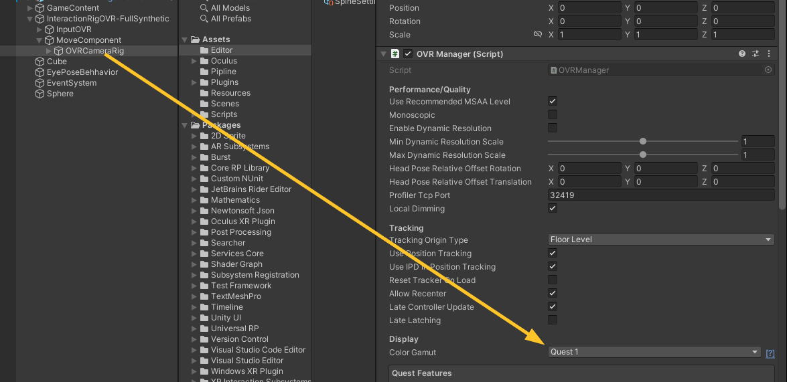

## Spine动画导入后播放颜色发白
由于使用线性颜色空间，Spine贴图的Gamma矫正不正确所以颜色会偏亮(贴图明暗明显不符合预期多半是Gamma的问题)。     
需要手动去把导入的贴图的`sRGB(Color Texture)`点上，这会弥补一次Gamma运算将贴图传送Shader时为线性颜色空间,给从而使最终的gamma矫正结果正确。
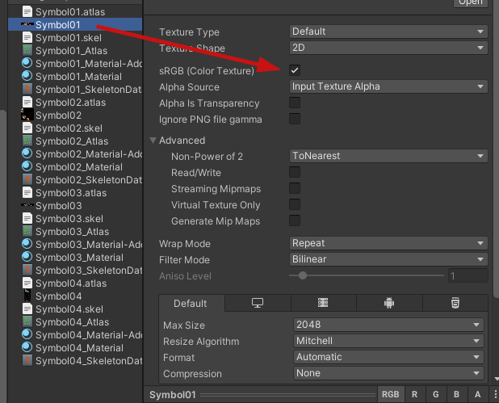       


## 快速修改命名空间
[ChangeNameSpace](../img/ChangeNameSpace.png)     
[NameSpace](../img/namespace.png)       
[NnameSpace](../img/AdjustNamespace.png)         
文件夹内的代码命名空间就会被全部重新设置为类似：
`namespace Game01.SlotGame.Framework.Script.Core`


  public class WebReqSkipCert : CertificateHandler
    {
        protected override bool ValidateCertificate(byte[] certificateData)
        {
            return true;
        }
    }


      request.certificateHandler = new WebReqSkipCert();


# newtonsoft依赖
包管理器，名称添加
com.unity.nuget.newtonsoft-json


# 头部位置
将`Locomotion`节点上的`Player Origin`设置为`InteractionRigOVR-Synthetic`
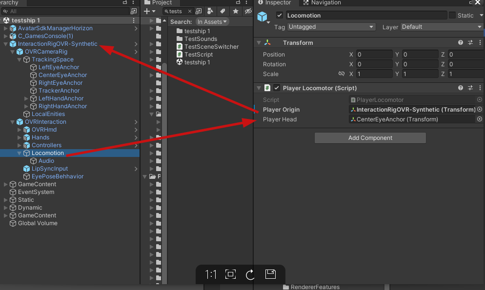

修改`OVRCameraRig`的Y轴
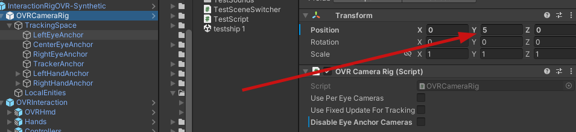


# Oculus Air Line 串流问题


1. 网络 尽量用好的梯子
2. 显卡驱动 版本536.99


# 打包后spriteMask和字体材质丢失（不显示）
link中添加
```
<linker>
  <assembly fullname="UnityEngine">
    <type fullname="UnityEngine.SpriteMask" preserve="all"/>
  </assembly>
</linker>
```
两个项目中Graphic Setting中添加     
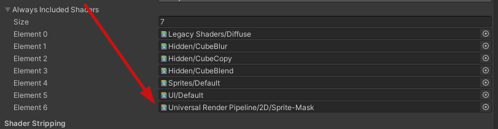


# 模型反射渲染不正常
反射的采样在模型上显示不正确，是因为自定义shader未处理压缩后的法线，需要将法线压缩格式更改为XYZ         
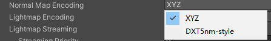