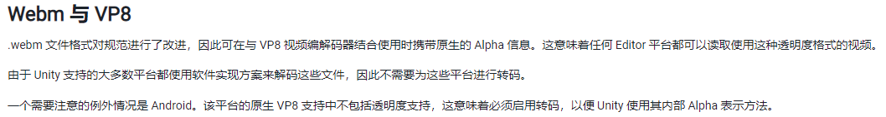
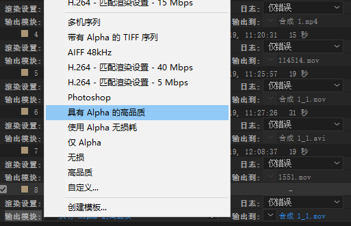
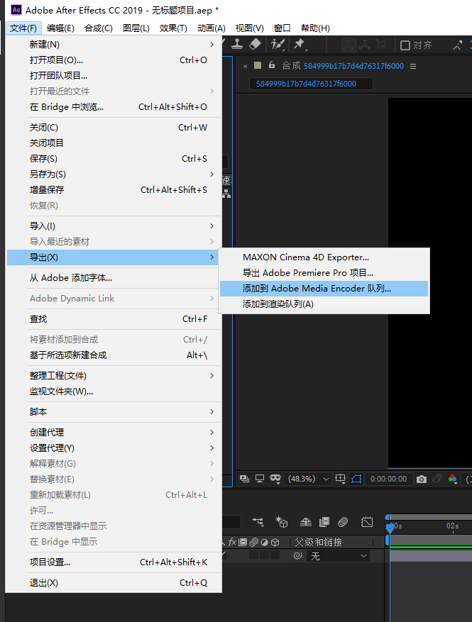
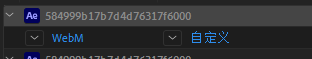
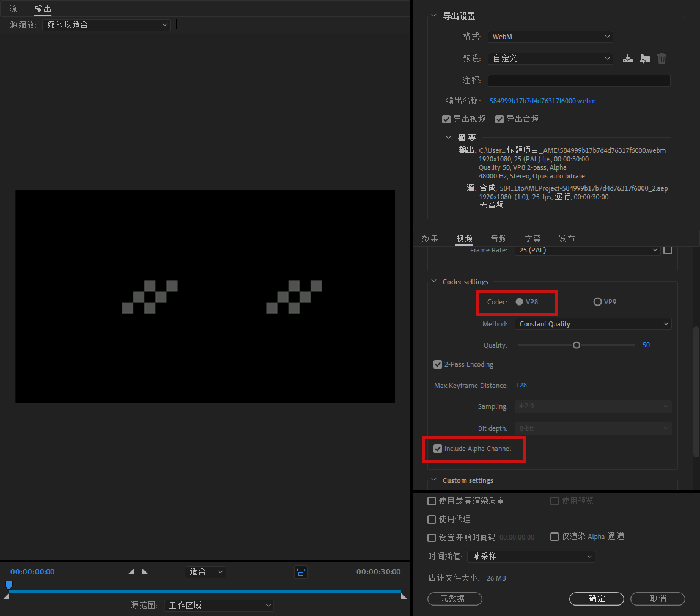
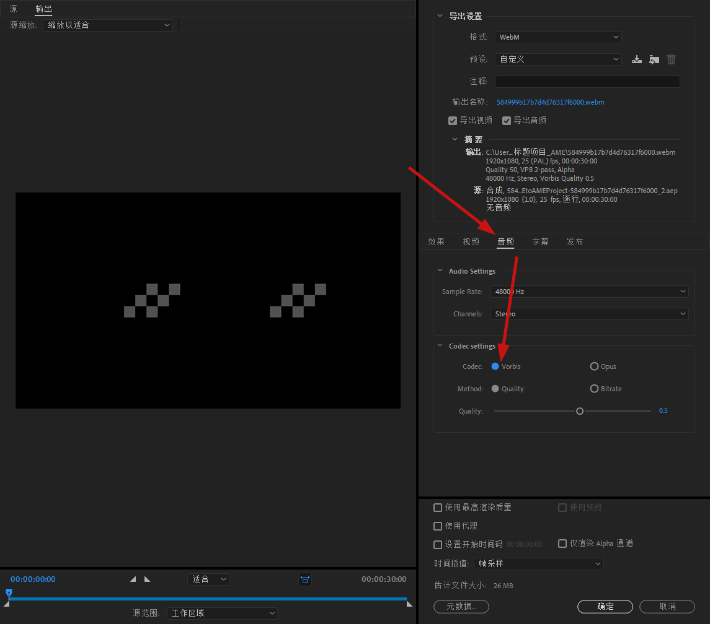
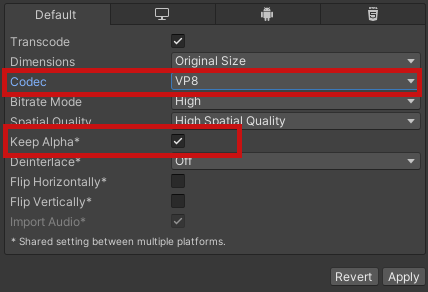
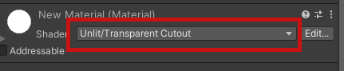

# 在Unity中播放带Alpha通道的视频

## 唯一的解决方案Webm



## AE导出    
在导出时选择预设选项`具有Alpha通道的高品质`，然后点击上述的选项进行具体设置然后渲染导出MOV视频。          
         
  
     
         

## 转码
直接将上述导出的视频拖入ME中或是直接通过AE项目，导出到相应版本的ME中（大版本一样不然不知道为什么没反应）。    

    
在ME中，设置导出格式为WebM，然后点击右侧的自定义将`Codec`选项调整为`VP8`,然后勾选`Include Alpha Channel`。需要注意的是在音频中需要将音频的`Codec`选择为`Vorbis`不然会影响视频导入进Unity。
      






### ffpegm（备选）    
如果使用ME无法达成目的FFMPEG是备选方案。
目前来看MOV视频无法直接导入unity，但是是使用VP8编码的webm格式时可以使用的（而且通过格式工厂转换的其他编码是不好用的，当然格式工厂导出VP8会报错）      
所以需要使用ffmpeg       
[FFMPEG下载（外网）](https://www.gyan.dev/ffmpeg/builds/)       
[FFMPEG下载（内网云盘）](https://cloud.518play.com/index.php/s/8C3Rwpn8XSKdE78)      
``` SHELL
ffmpeg -i {SrcPath} -c:v libvpx -pix_fmt yuva420p -b:v 1M -auto-alt-ref 0 -metadata:s:v:0 alpha_mod="1" -c:a libvorbis {DestPath}
```      
其中 **{SrcPath}** 需替换为mov格式视频的完整路径， **{DestPath}** 需替换为输出路径及输出文件名（尾缀为.webm）        

需要注意将ffmpeg所在路径添加进环境变量的`Path`条目以便像上述那样直接输入命令的名字就可以运行（非必须）       


## Unity导入
对于Android端使用带Alpha通道的视频有诸多限制，导入后进行如下设置（因为看了文档一次成功所以也没验证这个是否有必要，但是一定是能成功）       
      

使用Unity的`Video Player`播放，如果**Render Mode**设置为`Material Override`需注意设置渲染目标物体使用的是支持Alpha通道的shader。例如`Unlit/Transparent Cutout`     
     


## 音频报错
可以在导入选项`Import Audio`中禁用音频    

## 导入后卡顿
可以取消勾选Video Player选项`Skip on Drop`,且在导入选项中使用低比特率且Spatial quality设置为low Spatial quality。    
