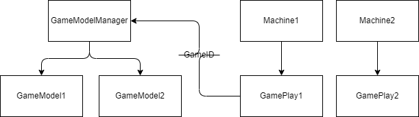
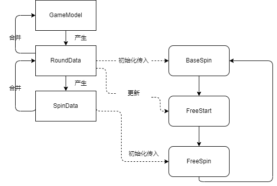

# Slot端整体设计
### 单独的游戏Model
此处原为静态类，如按之前的DEMO框架需求此处并无不妥且在学习成本和开发速度上是具有优势的，在框架的任何地方都可以被简单的访问获取，省去了由上至下传递的数据流。但是单个游戏内无法共存多个类似的实例（没有人能够预料到将来所面对的需求变化），随处可以被访问的优点导致其代码对于此类依赖过多较为都难以重构。        
现重构的思路为将会静态类转换为非静态类（这是基本需求），原本的数据内容并不会有变化。       
游戏模型将会在GamePlay(也就是框架内的Game Manager)中被要求创建并带着GameID托管给`GameModelManager`,而在需要取用时需通过GameID作为参数从`GameModelManager`获取。如下图所示。      
        
这样的方式可能会在未来对游戏的数据的互通具有优势，但是对游戏数据的解耦作用并不明显。       
一是在实现的过程中我没有去预先剥离接口，GameModel也许需要一个基类作为访问接口以应对未来GameMode的种类增多(这一定会是之后必然要面对的需求)。    
二是对数据类的依赖依然是之前的一整块数据的依赖。    
将静态类改为普通的数据对象意味着需要将数据层层传递给游戏内的诸多子模块，而传递过程的代码依然依赖同一个类型或是他的标志物。    
对数据的依赖是必然存在的，但是如果按数据的生命周期剥离出颗粒度更小的类而使依赖这个“整块的”数据去转而依赖生命周期更短的小类或许能提高封装性。当然这会更加复杂。       
例如在`GameplayModel`中当前余额`CurrCredit`项和Meter计数`Meters`项的生命周期与整个游戏的生命周期长度相同，而本轮赔付数值的生命周期`TotalWin`和`BetLevel`则对应一轮Spin的生命周期。或许在Spin时传入对应Spin的生命周期的数据以代替对整体的依赖或许会更好。从代码中看其实原先是有这样的设计就是`ResultBase`及其子类。      
可能之前自己理解错了,`ResultBase`的`TotalWin`应为Spin Win,即对应一次Spin的赔付（点击一下Spin就被清空）,而Modle里的`TotalWin`应为Round Win（即Base+Free所有赔付，其实这个应为真正意义上的TotalWin）。    
下图是不会真正写在代码里的思路。每个生命周期产生对应生命周期的数据并在生命周期内被更新，当生命周期结束后短生命周期的数据更新长生命周期的数据，数据流可以看作一个栈。左侧棱角方块为数据模型，由上至下生命周期生命周期更短。          
       

因需热更新应抽象出GameplayMode的积累以供公共模块使用。

### 赔付
赔付相关包括两部分，一是数据上赔付结果的计算，二是赔付时闪烁的动画相关部分。此部分照之前位于`GlobalObserver`也就是现在的`GameplayModel`中，数值计算部分因只有算法而不需要单独的数据，结构亦照之前不变。         

#### 抽象类
因动画部分需要自己独立的数据，所以进行了一些改变，赔付动画类预先抽离一纯虚类`AbstractDeduce`包含开始播放动画的方法`Deduce()`和结束动画的方法`Abort()`,因需要游戏数据所以（粗暴地）在虚类内添加对对应`GameplayModel`的引用。PayLine模式已有具体实现而PayTable模式暂时没有或许以后会被加入（建议依然继承`AbstractDeduce`实现）。   

#### 工厂  
工厂方法可以隐藏具体类的构建过程所以此处拥有静态类`DeduceFactory`和` AbstractDeduce BuildDeduce(GameplayModel model, PayMode payMode)`以构建具体的类。              
但是很多具体的赔付过程动画并未有具体的实现，所以此处的工厂类是否有必要添加是个值得考虑的事情，因为当新的赔付过程被添加时必须要对此工厂类进行修改以适应新的赔付过程。     

#### 实现
`Dictionary<GameState, AbstractDeduce> _deduceMap;`     
用以面对不同的游戏模式使用不同的赔付动画实现，当调用时会根据当前的游戏状态调用不同的实例。  

此处的赔付计算为单独的算法，而赔付动画与游戏视图相关，赔付动画类被放置在GameModel中有点不太合理。    

### Debug
现阶段需要将游戏拆到单独的Scene中，由于游戏需要将游戏移动至单独的场景中，所以将Device抽象出接口`ISlotDevice`为游戏提供必要信息，已有的`SlotMachineController`将实现这个接口并将自己的引用传递给`GameManager`。`DebugVirtualDevice`将不提供物理按键而只提供`DeviceInfo`以支持游戏运行。        

#### 后续修改
新建DebugScene以模拟需要加载游戏的情况     

