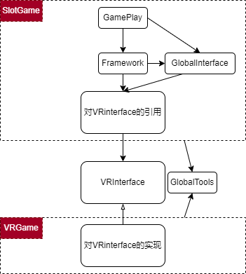

# VR项目设计
将目前的的项目移植到VR项目内需要进行较多的重构以适应在单个游戏内存在多个子游戏。目前遇到的问题较多为原设计的游戏数据或是模块多为静态类需重构为为每个游戏实例单独提供数据的对象。           
目前已将游戏的基本数据重构为单独的Model,重构赔付流程，和重构声音系统以适配新游戏需求。虽进行了新的构思但实现后这些“新的构思”中依然发现不少缺憾，令人遗憾的是这些缺憾并不重要也不需要被修改打磨，也许这篇文档也没那么有必要写。         
遂暂时打算边记录自己的想法边整理思路当作某种“重构游戏”。          
结构总是应该随着需求的变更不断被重构。        
如果有必要（个人认为非常有必要）将Dll移出Slot项目是可行的，这样会提供代码兼容的约束。    
因为后续需要扩展更多的游戏，而接口不可能在设计之初就被完全确定。所以所有接口的扩展和新功能的增加应谨慎沟通以实现，为保证兼容应添加新的接口而不是修改现有接口。      
VR端的游戏在后文中称作**VRGame**或**VR端**，而其中子游戏在后文中称作**SlotGame**或**Slot端**    
  

暂时的模块依赖情况如下图所示。           
        

## VR接口 \<VRInterface>
VR_Game中的`SlotMachine`需对VRInterface中的接口进行实现以为游戏提供必备的基础功能，例如声音播放模块和基本的Device信息。此部分作为两模块沟通的桥接层。对此模块的依赖跨越VR和Slot端。而Slot和Slot之间不会存在互相的依赖.            
[VR接口说明](../VR接口.md)      

## 通用模块 \<GlobalInterface>
通用模块为单独的Dll，其中包括对各个游戏Model的管理类，应在内只设置接口与纯虚函数以限制函数实现的变化。在设计上所有Slot游戏将依赖此模块而VR游戏不会存在此依赖。      
[通用模块说明](./Slot端整体设计.md)       

## 通用工具 \<GlobalTools>
之所以将通用工具从通用工具中分离出来，是因为其他模块对工具的依赖很强，但它对其他模块没有依赖.   

 

## 游戏框架 \<Framework>
游戏的基础框架，基于对原Demo框架的修改。制作新游戏时推荐基于此封装出额外的表现层。          
与此相关的Assembly需要设置成对应的游戏名称以防止热更新时命名空间冲突。

## 热更新插件
热更新插件的使用及必要设置，前置条件很多坑也很多。需要注意的是使用热更的情况下，在编辑器内和实际打包后的行为可能不同，所以应多进行打包后的实机测试。    
[热更新插件使用](../%E7%83%AD%E6%9B%B4%E6%96%B0%E6%8F%92%E4%BB%B6%E4%BD%BF%E7%94%A8.md)

