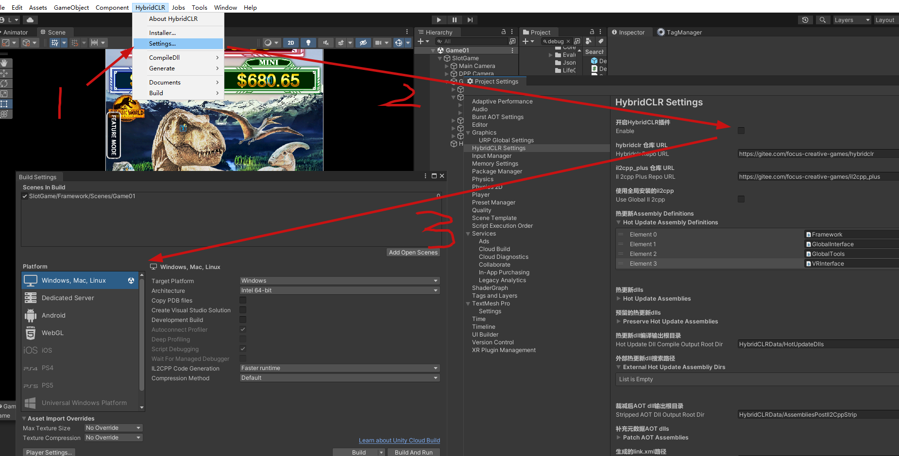
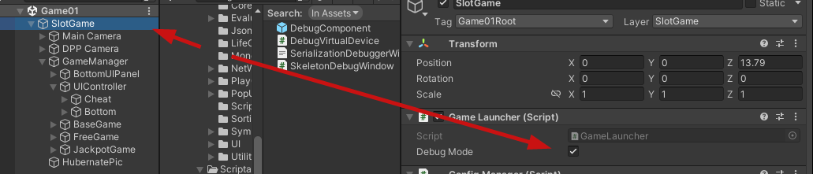
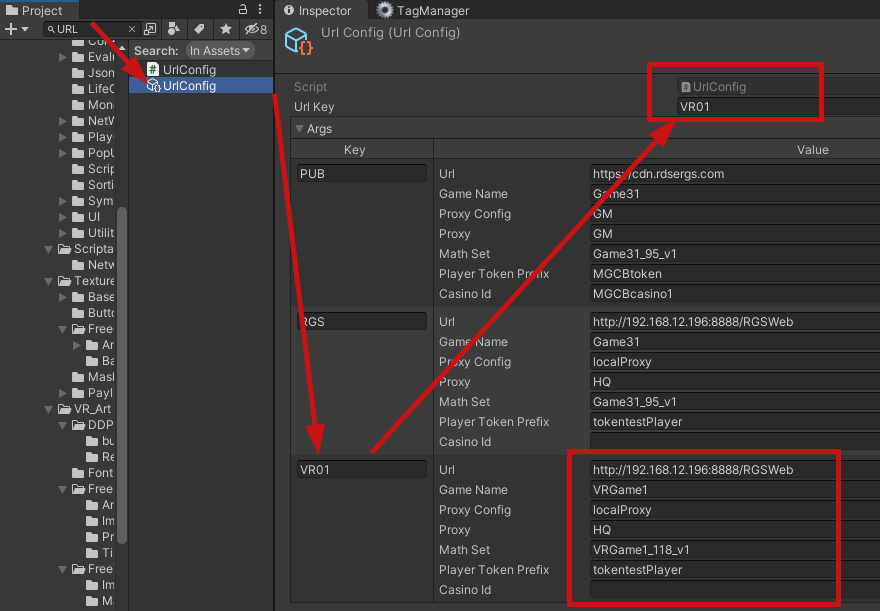

# 打包
打包分类两种情况.只在内部测试使用的Win端包，和使用VR运行的热更新包。

# Win端打包
在HybirdCLR选项卡中点击`Settings`然后**取消勾选**`开启HybirdCLR插件`选项。顺便将平台设置为Win平台打包。

选择游戏根节点之后确保`GameLauncher`组件上的`Debug Mode`选项**已被勾选**。     
     
在项目中搜索`UrlConfig`并点选，设置好URL链接参数后设置上方的`Url Key`为对应条目的名称。    
      
图中的链接目前已发生变化.
之后像打包Win客户端一样打包即可。

# 资源包上传
想办法将资源包上传到`\\RD28\VR_Asset`路径，此为共享文件夹。如没有意外这个文件夹会通过WinSCP将更改同步到局域网测试服务器上。
而在VR端的代码中，想要获取这个文件夹内的资源包需要访问 `http://192.168.12.211:81/VR_Asset/+后续具体的文件夹`，命名规则为 `<Local/Public>/<platform>/<GameID>`，Local代表Slot游戏的目标局域网内的测试所用的后端，Public代表资源包所使用的后端为公网后端，当然需要手动在上述`UrlConfig`中设置。此处暂时并不是自动选择（估计短时间内的未来也不是）