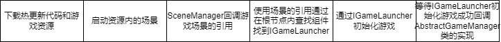
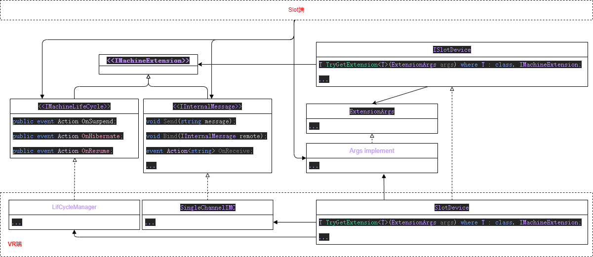

- [VR接口说明](#vr接口说明)
  - [目前明确的](#目前明确的)
    - [GameRoot](#gameroot)
    - [GameManager](#gamemanager)
    - [GameLauncher](#gamelauncher)
    - [GameID](#gameid)
    - [声音模块](#声音模块)
    - [机器按钮模块](#机器按钮模块)
    - [触控屏幕信息](#触控屏幕信息)
    - [Spawn对象池](#spawn对象池)
    - [内部通信](#内部通信)
    - [机器的生命周期回调](#机器的生命周期回调)
    - [VR与Slot动画交互](#vr与slot动画交互)
    - [配置文件](#配置文件)
  - [在VR游戏内加载Slot游戏的流程](#在vr游戏内加载slot游戏的流程)
    - [Device和GameLuncher](#device和gameluncher)
  - [在Slot端获取VR端的模块](#在slot端获取vr端的模块)
  - [对实现的约束](#对实现的约束)
    - [SlotGame必须有唯一的根节点，且附有实现了IGameLauncher的组件](#slotgame必须有唯一的根节点且附有实现了igamelauncher的组件)
    - [VR项目和Slot项目的排序图层问题](#vr项目和slot项目的排序图层问题)
    - [热更新模块要求](#热更新模块要求)


# VR接口说明
VR接口模块是VR端和Slot端交互的接口的桥接模块。       


## 目前明确的

### GameRoot
游戏在Hierarchy中应为唯一的GameObject，作为游戏的根节点方便子物体全局查找通用模块    

### GameManager   
目前需要提供给VR端的游戏的引用，或是向游戏传送按键、声音等其他模块的引用。    
### GameLauncher
初始化游戏的组件。VR端由此获得`GameManager`的引用     

### GameID
从游戏机处获取的对应游戏实例的独有ID（其实这部分可以自己生成）   

### 声音模块
或声音模块并不需要进行这样过度的设计，而在实现时为考虑到对象池内的脚本与此做法的冲突所以需要在SpawObject之后再次绑定其与声音管理对象的关系多半会成为未来犯错的主要原因。此处处理不甚妥当。    
或许机器应该只提供一个Interface并在初始化`GameManager`时传入。    

后续：    
声音模块被绑定在GameRoot上供全局查找调用   

 

### 机器按钮模块
在Slot端需要监控VR端的机械按钮的交互。     

### 触控屏幕信息
屏幕模块交互      
**为屏幕交互模块添加标志为VR端获取屏幕后需区分屏幕交互模块的引用

**屏幕交互模块 TouchViewCamera 需要抽象出接口**

### Spawn对象池
Spawn对象池如何设计？是否应该共享内存资源？如果共享接口是否过于复杂。       
可共享资源过少，可能付出的工作过多结果却收效甚微。          
区分资源会**要求**后续工作进行过多的必要设置引发问题。      
不如隔离开每个游戏一个。     

也许在SpawnConfig被填入的时候对资源进行Hash然后存储，Load之后比对Hash以区分共同资源（又一个雾件思路）      
 
对象池生成的新对象在主游戏中会被创建于主场景下而非对应的游戏场景，需考虑将Spawn和Audio生成的子物体挪动到对应游戏的游戏场景内是否更加有利。（或许会更方便地销毁物体）   
      
Spawn模块被绑定在GameRoot上供全局查找调用，Spawn本身创建子物体的时候会将GameRoot的引用传递给子物体以便子物体使用Slot游戏的全局模块     


### 内部通信
为应对未知需求，需通过实现`IInternalMessage`接口完成内部通信，暂时只支持发送字符串（可能需要扩展发送byteArray，目前有`SingleChannelIMC`作为具体实现以达到VR端的机器和Slot端1对1通信。

### 机器的生命周期回调
VR端通过实现`IMachineLifeCycle`发送机器生命周期事件，暂时状态包括`Suspend`、`Hibernate`和`Resume`.
当机器挂起时播放视频动画，当机器休眠时只播放图片，Resume恢复到游戏状态。

### VR与Slot动画交互
VR与Slot涉及到不同版本参数传递的问题，
[VR与Slot动画交互](./VR%E4%B8%8ESlot%E4%BA%A4%E4%BA%92%E5%8A%A8%E7%94%BB.md)


### 配置文件
配置文件暂时只将其移动至目标项目能运行即可，到时候看后端如何     
可通过**Odin插件**序列化**ScriptableObject**设置配置


## 在VR游戏内加载Slot游戏的流程
因性能问题应避免使用反射，在场景被加载之前预先加载对应的热更新代码然后再加载场景，加载的场景内部物体挂载的脚本是生效的。         


### Device和GameLuncher
此处介绍如何通过VRInterface加载场景并初始化游戏。     
VR端示例代码在[VR示例](D:\LiuHongSen\TempProject\HotUpdate\Assets\Scripts\DebugVirtualDevice.cs)`D:\LiuHongSen\TempProject\HotUpdate\Assets\Scripts\DebugVirtualDevice.cs`          
在VR端,游戏机应实现`ISlotDevice`以为SlotGame提供硬件(虚拟)层面的支持。     
在Slot端，游戏必须实现`IGameLauncher`用以让VR端启动游戏且提供`AbstractGameManager`的实现。    

## 在Slot端获取VR端的模块
为方便未来扩展在`ISlotDevice`中添加如下函数：
``` csharp
 T TryGetExtension<T>(ExtensionArgs args = null) where T : class, IMachineExtension;
```
诸如声音的策略及生命周期的回调，需要在`VrInterface`中提供继承了`IMachineExtension`的具体接口以提供给Slot端。        
Slot端通过向模板参数内填入接口类型以获取VR端提供的扩展支持。    
更复杂的UML：     
     


## 对实现的约束
在`VRInterface`中的接口规定了SlotGame和VRGame**必须**做什么以保证游戏功能的实现。为游戏实现提供了代码层面的约束。
但是依然会有无法通过代码进行约束的一些前提条件这其实可以算作是设计上的失误。     


### SlotGame必须有唯一的根节点，且附有实现了IGameLauncher的组件
VR端会查找新加载的场景中的根节点`IGameLauncher`用以初始化SlotGame，虽多个根节点依然可以查找到但是场景保持一个根节点性能消耗较少，应是最佳实践。也就是上述的[GameRoot](#gameroot)     

因一个VR端需要加载多个不同的或相同的游戏，为避免各个实例互相干扰所以对代码中的静态变量或组件有诸多要求。而如今的框架是基于现有框架的修改，以往的框架中的静态组件或代码需修改为非静态。这导致可能会有非常长的依赖传递的数据流。所以暂时的解决方式是把以往全局的静态组件（例如Spawn和Audio）附加在根节点上然后通过根节点查找这类本是全局通用的组件。   
其中的缺陷和待修改项请查看上文中的[声音模块](#声音模块)和[Spawn对象池](#spawn对象池)说明。     
VR游戏中应有个`EventSystem`还有一个`AudioListener`，这个应该不是问题    

### VR项目和Slot项目的排序图层问题
VR项目缺少Slot项目的排序图层会使图层混乱    


### 热更新模块要求 
[热更新模块设置](./%E7%83%AD%E6%9B%B4%E6%96%B0%E6%8F%92%E4%BB%B6%E4%BD%BF%E7%94%A8.md)
因跨项目使用热更新模块所以注意谨慎使用`static`关键字，并且`[Serializable]`在热更新后无法被正确序列化。


