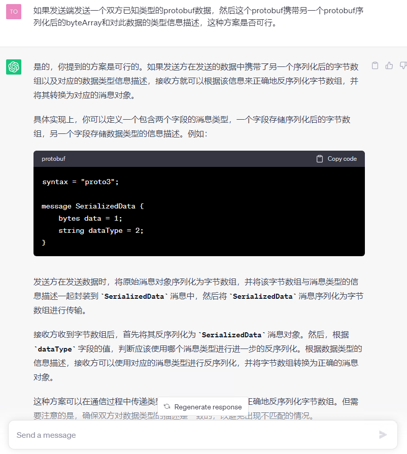
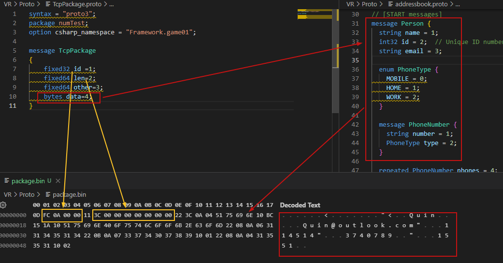

# 后端
后端或许会采用protoBuf作为传递信息的载体


## ProtoBuf
二进制的优势不再赘述         
protoBuf会通过自身的编译器产生对应语言的源代码，代码中包含对应protoBuf的结构信息和序列化函数，对于定义好的Proto不用针对对应的结构写出对应的类型结构。         
而对于数据结构的定义，可直接引用其他proto文件内的Message结构相对于Json会简洁不少。          
而编译之后结构不易被改变，交互双方可直接根据编译结果直接着手写出代码。当然需要保证的使双方使用的代码是同一次编译产生的源文件，对相关proto的管理设计和修改需要仔细斟酌，当然这些限制反倒可以确保对数据进行改变时进行过有效的沟通。      

### 结构
对于Http协议下的交互，一次请求中使用的数据结构是可以直接确认的，但是如果之后使用到TCP，接收方接收到的多数是字节数组，对于每一次交互的数据类型是无法直接确认的，接口可以采用ProtoBuf嵌套的方式去解决。



### TCP协议
当然在TCP中采用此方式会可能会遇到诸多其他问题例如如何拆包，Protobuf能够保证序列化后Array byte对于结构的顺序。或许这会有所帮助。

在proto中使用 `fixed32` 或`fixed64`类型可以定义序列化后定长的数字    

[TCP Package示例](../Proto/TcpPackage.proto)    
[内容示例](../Proto/addressbook.proto)      
[Result](../Proto/package.bin)     
``` csharp
  void TcpData()
    {
        Person personData = new Person
        {
            Name = "Quin",
            Id = 0xabc,
            Email = "Quin@outlook.com"
        };


        personData.Phones.Add(new Person.Types.PhoneNumber()
            { Number = "114514", Type = Person.Types.PhoneType.Mobile });
        personData.Phones.Add(new Person.Types.PhoneNumber()
            { Number = "3740789", Type = Person.Types.PhoneType.Home });
        personData.Phones.Add(new Person.Types.PhoneNumber()
            { Number = "1551", Type = Person.Types.PhoneType.Work });


        TcpPackage package = new TcpPackage()
        {
            Id = 0xAFC,
            Len = (ulong)personData.CalculateSize(),
            Data = personData.ToByteString()
        };

        var fi = File.OpenWrite(@"D:\SystemDir\Desktop\doc\VR\Proto\package.bin");
        package.WriteTo(fi);
        fi.Flush();
        fi.Close();
    }
```
   
可以看出`fixed`类型编码后为固定长度极适合定义TCP包头，应注意proto的数字编码方式为小端排序。     
不过在示例中`Other`字段未被赋值在序列化后被会忽略。其后的data对应序列化后的[Person](../Proto/addressbook.proto)字段。      
在Tcp包内id可设置为定值用于在代码中确认TCP包的头部。     
`len`为此包携带的数据长度也就是`data`字段的长度，可在具体的data被序列化后获得，用于确定包的完整性，当接收TCP包时应检测其内Data长度是否符合`len`。如符合则证明数据包完整，如不符合则需缓存数据等待下一次TCP接收。当下一个TCP包到达时拼接数据包并查找上述的id包头，如检测到包头需与缓存内的内容拼接后再次通过`len`检测数据包完整性，如不完整则丢弃缓存内和下一个包头前的数据，如完整则可进行后续处理。
--proto_path=E:\Other\protoc\proto

protoc.exe --plugin=protoc-gen-csharp-grpc=./grpc_csharp_plugin.exe   --csharp_out=./Out --csharp-grpc_out=./Out  -I ../proto hello.proto


