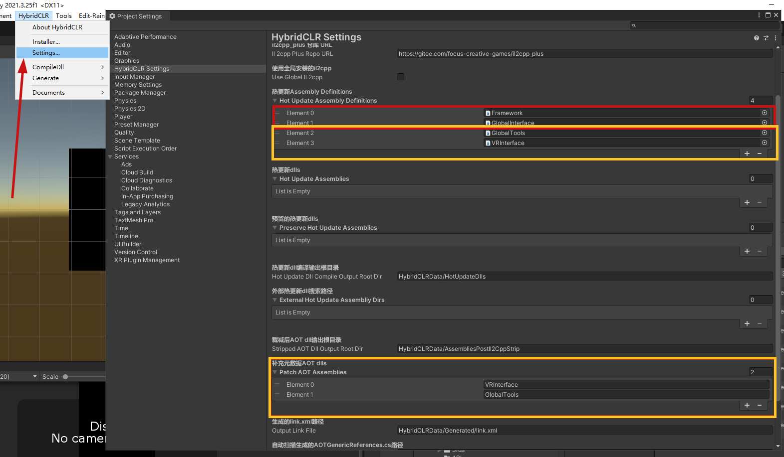
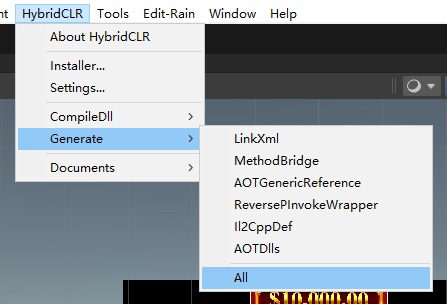
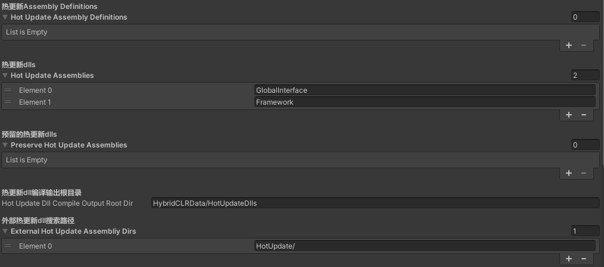

# 热更新插件使用

`Framework` Assembly的名称需要根据游戏名称设置，此处仅作为示例

## 热更新模块安装 
在VR Game和Slot Game两端安装HybridCLR插件       
`https://gitee.com/focus-creative-games/hybridclr_unity.git`     
 
顺便添加AssBundle Browser      
`https://github.com/Unity-Technologies/AssetBundles-Browser.git`    
      
阅读[官方说明文档](https://hybridclr.doc.code-philosophy.com/docs/intro)安装热更新插件

## Slot端设置
红框内为必要设置，黄框内是不需要热更新的Dll为了编译方便顺便放入的。    

在游戏构建之前点击Generate->All      

之后在`{项目根目录}\HybridCLRData\HotUpdateDlls\Android`找到上文设置中与红框内Assembly名字相同的Dll在文件名称末尾添加`.bytes`然后复制到项目的`{项目根目录}\Assets\SlotGame\Framework\HotUpdate\Dlls`。

黄框内的Assembly通常不应被更改，如必要更改需要与VR端程序沟通，更改后需要将编译好的Dll交付VR端将版本同步。

## VR工程热更新设置
确保非热更新Dll为最新版本    
需要将热更新DLL放到项目根目录`/HotUpdate/{plantform}`内，`{plantform}`通常为`Android`.    
设置externalHotUpdateAssemblyDir指向`/HotUpdate/{plantform}`(项目根目录的相对路径)    
在构建前，在Unity界面上方点击`HybridCLR->Gennerate->All`生成必要的构建项目之后通过unity构建APK    

必须填写`外部热更新搜索路径`和`热更新dlls`    
热更新Dlls项只需要dll的名字而不需要填写`.dll`尾缀    
Framework根据SlotGame的设置而变化      

查看自动生成的`AOTGenericReferences.cs`，在`{项目根目录}\HybridCLRData\AssembliesPostIl2CppStrip\Android`下找到对应的AOT补充Dll，在名称末尾添加`.bytes`放如`StreamingAsset`在加载Slot之前加载这些Dll。

      
      
