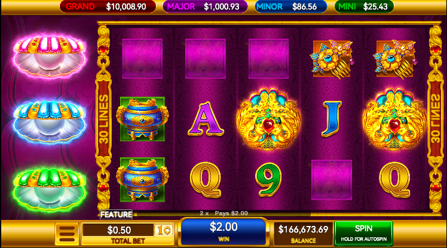

## 目录
- [2023-08-24](#2023-08-24)
- [2023-09-01](#2023-09-01)
- [2023-09-15](#2023-09-15)
- [2023-09-22](#2023-09-22)
- [2023-09-28](#2023-09-28)
- [2023-10-12](#2023-10-12)
- [2023-10-27](#2023-10-27)
- [2023-11-03](#2023-11-03)

## 2023-04-21
  - [x] BonusShell动画素材填入和类型构建
  - [x] Base和Bonus背景和滚轮背景素材填入
  - [x] 调整Base Reel Frame位置
  - [x] 调整Base Shell动画的位置
  - [x] Bonus Shell Prefab放入游戏中
  - [x] 后端切换成Pay All并仅暂时能运行游戏
  - [x] Pay All赔付适配     
  - [x] 下方横栏文字适配
  - [x] 根据后端数据触发Bonus      
  

  ## 2023-04-28
  - [x] 珍珠上飞动画
  - [x] Bonus初始时同位置显示金币
  - [x] 新后端运行
  - [x] 进入Bonus后新补4个Coin
  - [x] 进入Bonus后新补的Coin动画
  - [x] 滚出金币触发珍珠上飞动画
  - [x] Bonus金币根据类型显示

 

  ## 2023-05-06
  - [x] 作弊适配 
  - [x] Base的Coin类型根据后端数据显示 
  - [x] Bonus Shell 文字素材
  - [x] 进入后非触发珍珠变成普通金币
  - [x] 下边栏位的Symbol表示
  - [x] 适配新框架
  - [x] 重连后初始化
  - [x] 金币刷新
  - [x] Reel边框调整 
  

  ## 2023-05-12
  - [x] 赠送的4个金币数值有问题
  - [x] Bonus1珍珠刷新与触发
  - [x] Bonus1金币收集动画

  - [x] Bonus1珍珠转换乘金币动画还有点问题
  - [x] 第二个收集珍珠刷出时上边带有数字 （应修复）
  - [x] 收集动画应阻塞Spin
  - [x] Bonus触发时的背景素材
  - [x] Bonus触发弹窗素材安装
  - [x] Bonus进入后shell位置
  - [x] 音乐播放有Bug，添加BonusGame音效
  - [x] Bonus2触发后的行为
  - [x] Bonus触发弹窗素材位置
  - [x] Bonus3触发及所有玩法组合触发
  - [x] 触发Bonus时音效添加
  - [x] 替换Loding静态素材
  
  
  ## 2023-05-19
  - [x] 珍珠停止时的Hit动画
  - [x] 贝壳升级逐级和一个贝壳触发两次的问题 
  - [x] Bonus2动画素材
  - [x] 珍珠停下音效
  - [x] 降级打断
  - [x] 多个相同珍珠触发贝壳Hit动画有问题
  - [x] Grand Cele
  - [x] 乘法动画显示有问题
  - [x] 断线重连的贝壳等级恢复 （做了一半）
  - [x] 修复Replay中的一些问题

  ## 2023-05-26
  - [x] 回放时Jackpot的数值同步
  - [x] Replay
  - [x] 修改Bonus珍珠的位置
  - [x] coinStop的层级再播放时应该提上来
  - [x] 更改Help Panel内容
  - [x] 添加动画
 
  ## 2023-06-02
  - [x] 转盘逻辑重构
  - [x] 重构VR项目的游戏数据类
  - [x] 重构VR项目的声音类
  - [x] 重构赔付和赔付动画结构
  - [x] VR添加基础移动
  - [x] 重构AudioPLayer使声音在机器的位置播放 

  ## 2023-06-09
 - [x] 修复机器上方的屏幕只在单眼下被渲染
 - [x] Avatar 手部碰撞体添加
 - [x] 添加美术场景
 - [x] 修改框架使用的Unity版本
 - [x] VR子游戏划分模块并添加文档
 
  ## 2023-06-16
 - [x] 新建测试项目
 - [x] 模拟Asset Load 测试场景加载
 - [x] 解决Spawn冲突 Audio冲突
  
  ## 2023-06-21
 - [x] 测试Asset打包和加载热更新游戏
 - [x] 完善文档和注释 

  ## 2023-06-28
 - [x] 热更新情况下Spawn Config未正确加载问题
 - [x] 热更新情况下reelSetting丢失问题
 - [x] 热更新部分已能在实机跑通
 - [x] 重构代码，消除接口中的实践

## 2023-07-07
项目名：VR-Slot
1. 热更新代码随AB包自动打包
2. 后端bet配置接入
3. 后端Symbol列表初始化接入
5. Protobuf协议测试
6. 后端结果接入

项目名：KGI29
1. 修复滚轮速度过慢

## 2023-07-14

项目名：VR-Slot

1. VR端生热更新后自自动复制AOT补充DLL到Resource文件夹，并在运行时补充AOT
2. 修复打包后DDP Screen点击没反应
3. 修复Avatar手部碰撞体生成问题
5. `Could not produce class with id xxx`问题解决，并记录于[疑问与解决思路](../VR/%E6%97%A5%E5%BF%97/0000%E7%96%91%E9%97%AE%E4%B8%8E%E8%A7%A3%E5%86%B3%E6%80%9D%E8%B7%AF.md)
6. 暂时解决在VR中屏幕上显示的画面发白
7. 初始化代码分布到多帧。
8. 为机器添加IExtension接口，未来将通过此接口获取VR端游戏机所提供的可扩展的功能支持，并将VR端的游戏机声音系统和Machine-Slot内部通信系统等重构为支持通过该接口查寻。
9. 机器状态回调接口，暂时包括待机、休眠和恢复，但是暂时Slot端未实现对这些回调相应的动作
10. 简单实现接收后端的信息后的消息分发类，通过flag双向过滤传递后端结果
11. 将后端解析后的大结构体拆分多个类型减少颗粒度，并在新类型中转换出原有Slot游戏能够使用的类型（正在进行）

## 2023-07-21

项目名：VR-Slot

1. PayTable和PayLine由后端返回的数据决定
2. 基础分数变换发送后端数据请求服务器
3. Android播放带Alpha通道的视频测试
4. RGS31后端准备接入
5. 增加FreeReel的解析
6. 调整Payline的解析
7. 修改cheat的实现
8. Scatter和Hyper的逻辑修改

## 2023-07-28

项目名：VR-Slot
1. 渲染管线切换为URP
2. 触发FreeGame
3. 添加Scatter赢家赔付
4. 新游戏滚轮数量修改
5. 一轮Spin FreeGame结果显示
6. FreeGame每一轮Spin表格替换
7. FreeTotalWin素材及结果显示
8. Symbol赔付动画素材替换

## 2023-08-04
项目名：VR-Slot
1. 剔除原本Json操作中冗余的转换。
2. 素材接入，替换Symbol素材
3. 替换mask素材
4. 调整滚轮适应新分辨率
5. 调整cheat组件适应新的分辨率
6. 删除旧的美术资源
7. 在修改Reel生成脚本以使用字符串指定附载在Reel GameObject上的脚本
8. Jackpot后端接入
9. 解决Spine导入后的Gamma矫正问题
10. 提出空的VR项目
11. Free Intro 素材替换
12. Free Wild总数显示
 
## 2023-08-11

项目名：VR-Slot
1. 修改Free的声音，修改wildDown的扫描算法
2. Symbol换成序列帧
3. 同步投币等级
4. Meter字体替换
5. 修正Hyper行为
6. Spin时播放Wild Down动画
7. OnReel数字逻辑
8. 统一修改热更新模块的命名空间
9. 实现访问外网后端

## 2023-08-18

项目名：VR-Slot
1. Jackpot玩法
2. Jackpot赔付惠普meter重置
3. 静态素材合批
4. 底边素材替换
5. FreeSpin次数
6. 后端更新对接新后端
7. 替换Free Spin时所使用的表格

# 2023-08-24
1. 新模型场景
2. 解决cheat按钮问题
3. Free素材
4. 线赔动画线的细节修改
5. 开始VR正式项目的配置

# 2023-09-01
1. 导入新场景
2. 曲面屏碰撞检测
3. 手部模型碰撞体修改以适应触屏
4. 改变移动线的颜色
5. 修复手部碰撞体产生的BUG
6. DDP Spin修改

# 2023-09-15
1. Jackpot 和 鸭子音效修改
2. 模型替换
3. Jackpot球体浮动
4. Jackpot Intro修改
5. 打包问题修复

# 2023-09-22
1. GRPC引入
2. KCP和Mirror插件引入
3. 调试VR场景
4. 替换VR素材
5. VR抓取物品后的物理运动

# 2023-09-28
1. 替换VR创景素材
2. Bloom
3. 网络同步基础物品
4. 正在测试实现网络同步玩家
5. 将Slot和VR接口的DLL抽离出新的项目

# 2023-10-12
1. 网络玩家位置同步
2. 刚体物体同步
3. 玩家动作同步
4. 优化：玩家动作同步时通过LOD发送数据包
5. 解决玩家拾起物品时手部和物体在远端相对位置会有偏差的问题
6. 恢复触屏时的手柄震动
7. 整理文档，对于之后的工作进行预先的设计

# 2023-10-27
1. 修改加载游戏的逻辑统一管理游戏机加载的时需要的数据以便未来接入
2. 同时加载Game1和Game2修正多个游戏加载后的逻辑，同时修改资源包结构以便被正确加载
3. 尝试解决游戏被加载后物体不能被合批的问题

